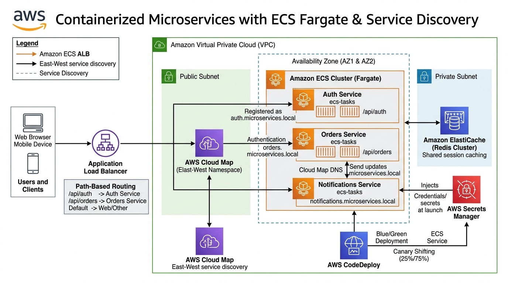

# Containerized Microservices with Amazon ECS Fargate, AWS Cloud Map & ElastiCache

A production-ready microservices architecture migrating a legacy monolithic web application into three decoupled containerized services—**Auth Service**, **Orders Service**, and **Notifications Service**—orchestrated on serverless **Amazon ECS Fargate**. Features private East-West service discovery with **AWS Cloud Map**, centralized distributed caching via **Amazon ElastiCache for Redis**, zero-downtime **Blue/Green deployments** via AWS CodeDeploy, and zero hardcoded credentials using **AWS Secrets Manager**.

---

## Table of Contents

- [Solution Overview](#solution-overview)
- [Architecture Diagram](#architecture-diagram)
- [AWS Services Used & Why](#aws-services-used--why)
- [Microservices Decomposition & Path Routing](#microservices-decomposition--path-routing)
- [Design Decisions & Well-Architected Trade-offs](#design-decisions--well-architected-trade-offs)
- [Cost Estimation & Optimization](#cost-estimation--optimization)

---

## Solution Overview

Monolithic architectures suffer from long deployment cycles, blast-radius exposure (a crash in notifications takes down billing), and inefficient scaling (the entire stack must scale out to satisfy one CPU-heavy route).

This solution decomposes the application into containerized microservices:
- **Zero EC2 Host Management**: Amazon ECS Fargate provisions container compute on demand with dedicated kernel isolation per task, removing operating system patching and host scaling maintenance.
- **East-West Private Discovery**: Internal microservices communicate privately over `*.microservices.local` DNS names managed by AWS Cloud Map without passing through public load balancers.
- **Stateless Containers with Redis Caching**: Amazon ElastiCache for Redis stores authenticated sessions, enabling containers to terminate or scale out horizontally without dropping user state.
- **Canary Blue/Green Deployments**: AWS CodeDeploy routes 10% of production traffic to the new revision for 5 minutes, automatically rolling back if CloudWatch detects elevated HTTP 5xx error rates.

---

## Architecture Diagram

---

## AWS Services Used & Why

| Service | Role in Architecture | Why We Chose This Service |
|---|---|---|
| **Amazon ECS Fargate** | Serverless Container Compute | Runs microservice Docker containers without requiring the management, scaling, or patching of EC2 instances. Fargate provides per-task kernel isolation, fine-grained CPU/memory allocation, and rapid autoscaling based on task CPU and memory metrics. |
| **Amazon ECR** | Secure Container Registry | Hosts container images privately with automated vulnerability scanning on push (using Clair/Inspector engines) and immutable image tags to prevent unauthorized tag overwrites. |
| **AWS Cloud Map** | Private East-West Service Discovery | Registers dynamic IP addresses of running Fargate tasks into a private Route 53 DNS namespace (`microservices.local`). Microservices query each other directly over DNS without the latency, complexity, or cost of internal load balancers. |
| **Application Load Balancer (ALB)** | Public Ingress & Path-Based Routing | Fronts incoming public client traffic, routing requests based on URL paths (`/api/auth/*` to Auth Target Group, `/api/orders/*` to Orders Target Group) to consolidate public ingress into a single endpoint. |
| **Amazon ElastiCache for Redis** | In-Memory Distributed Caching | Stores active session tokens and blacklist caches in sub-millisecond in-memory storage, enabling ECS container tasks to remain fully stateless and freely scale out or in without losing user session state. |
| **AWS Secrets Manager** | Centralized Credential Security | Stores database passwords and JWT signing keys securely, injecting them directly into container memory via ECS task execution roles at task boot time, eliminating hardcoded environment variables. |
| **AWS CodeDeploy** | Safe Zero-Downtime Deployments | Automates Blue/Green Canary deployments (`Canary10Percent5Minutes`), routing a small percentage of traffic to the new task set and rolling back automatically if CloudWatch error alarms trigger. |
| **Amazon CloudWatch** | Container Insights & Observability | Collects container-level CPU, memory, and network metrics along with application log streams, providing automated alerts when unhealthy thresholds are breached. |

---

## Microservices Decomposition & Path Routing

| Service Name | Path Routing Rule | Port | Memory / CPU | Discovery DNS Name | Downstream Dependencies |
|---|---|:---:|:---:|---|---|
| **Auth Service** | `/api/auth/*` | 8080 | 0.5 vCPU / 1GB | `auth.microservices.local` | ElastiCache Redis, Secrets Manager |
| **Orders Service** | `/api/orders/*` | 8081 | 1.0 vCPU / 2GB | `orders.microservices.local` | Auth Service (DNS), Postgres DB |
| **Notifications Service** | Internal Worker | 8082 | 0.5 vCPU / 1GB | `notif.microservices.local` | Amazon SES / SQS |

---

## Design Decisions & Well-Architected Trade-offs

| Decision | Trade-Off & Technical Rationale |
|---|---|
| **ECS Fargate vs EC2 Container Instances** | Fargate eliminates managing EC2 container instances, AMI patching, and cluster capacity agents. You pay strictly for the CPU seconds and memory utilized by running tasks. |
| **AWS Cloud Map vs Internal Load Balancers** | Internal ALBs introduce added latency, LCU costs ($22.50/mo each), and extra hops. Cloud Map registers container IP addresses directly in Route 53 private DNS, allowing direct container-to-container calls. |
| **Secrets Manager Injection at Launch** | Storing database passwords in Dockerfiles or plain environment variables creates critical security leaks. Secrets Manager injects secrets into container memory at container startup via task execution role permissions. |
| **Blue/Green Deployment with Auto Rollback** | In-place rolling updates risk exposing 100% of users to undetected regression bugs. Blue/Green maintains the green environment side-by-side and rolls back instantaneously if target response times exceed thresholds. |

---

## Cost Estimation & Optimization

| AWS Service | Configuration Details | Estimated Monthly Cost |
|---|---|:---:|
| **ECS Fargate Tasks** | 5 running tasks (0.5 vCPU, 1 GB RAM each) | ~$36.50 |
| **Application Load Balancer** | 1 ALB (~15 LCU-hours/mo) | $22.50 |
| **Amazon ElastiCache Redis** | 1x `cache.t4g.micro` node | $11.70 |
| **Amazon ECR** | 5 GB storage across microservice images | $0.50 |
| **AWS Secrets Manager** | 2 secrets with automated rotation | $0.80 |
| **AWS Cloud Map** | 1 Private DNS namespace + 3 registered services | $1.50 |
| **Total Estimated Cost** | | **~$74.50 / month** |

> **Cost Optimization Tip**: In non-production environments, utilize **Fargate Spot** for stateless worker tasks (e.g. Notifications) to achieve up to a 70% discount compared to on-demand pricing.
